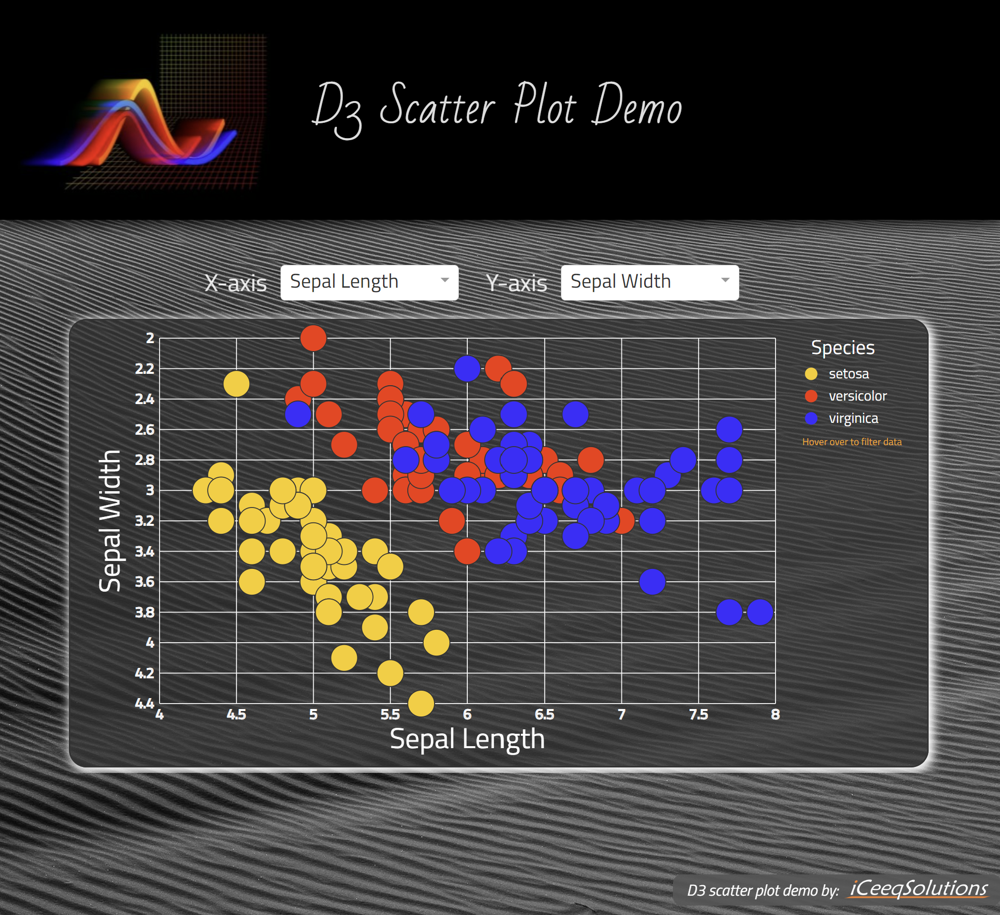

# D3 Scatter Plot - React demo application with GitHub Gist connection.

  D3 Scatter Plot Demo by <a href="https://iceeqsolutions.fi/">iCeeqSolutions</a>

## About

D3 Scatter Plot demo shows how the D3.js library can be used to visualize data. In the scatter plot demo, we have used the well-known Iris flower data set from the 1930's paper "The use of multiple measurements in taxonomic problems".

By selecting a combination of features to view on the x-axis and y-axis, we can see that the different species have specific characteristics, which in turn makes it possible to set them apart based on the length and width of their leaves.

## Demo

👁️ [Live Demo](https://d3-scatter-plot.iceeqsolutions.fi/)

## Built with

- JavaScript
- CSS
- Vite
- React
- NPM
- SVG
- D3.js
- GitHub Gist
- ESLint
- Prettier

## Features

- Interactive scatter plot graph
- Drop-down menus
- SVG elements

  

  
